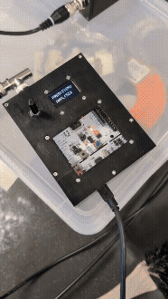
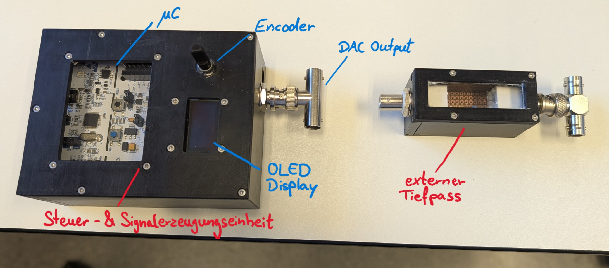
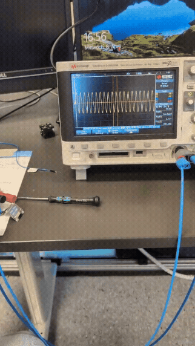
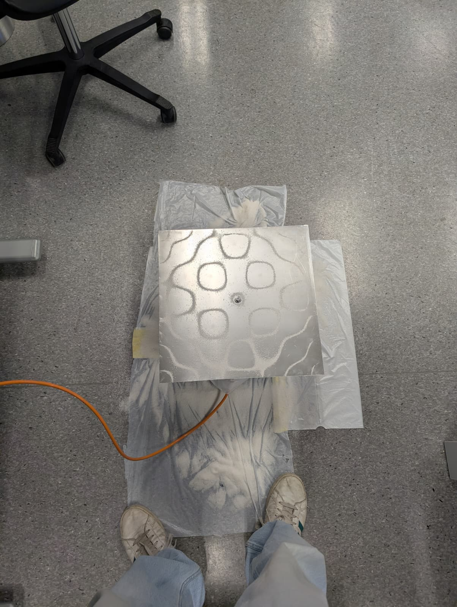

# Chladni Klangfiguren – STM32 Signal Generator

## Overview

This project uses an **STM32 Nucleo-L476RG** development board to generate a sinusoidal excitation signal for a **Chladni plate experiment**. By adjusting the excitation frequency, standing wave patterns can appear on a metal plate covered with fine salt or sand.

The signal is generated with the MCU DAC and can be controlled in real time with a **rotary encoder** and a **push button**. The selected frequency and amplitude are shown on an **OLED display** and are also sent over **UART** for monitoring, for example with Teleplot.

The system is intended as a compact **Chladni Signal Generator Control Unit** for driving an external amplifier and shaker.

## Goal

The purpose of the project is to excite a plate mechanically so that **Chladni figures** become visible. Different frequencies excite different vibration modes and therefore lead to different particle patterns on the plate.

## Demonstration

The following GIF shows a typical demonstration sequence including oscilloscope signal, shaker excitation and resulting Chladni figure:



## System Components

The setup consists of the STM32-based signal generator control unit, an external low-pass filter, an amplifier, a shaker and the Chladni plate.



## Important Note

Before starting, check the **firmware of the development board / ST-LINK**.

During development, communication problems were caused by:

- outdated board / debugger firmware
- a baud-rate mismatch

After updating the firmware and correcting the baud rate, UART communication worked reliably again.

## Hardware

- STM32 Nucleo-L476RG
- Rotary encoder
- Push button
- OLED display via I2C
- UART output for monitoring
- External low-pass filter after DAC output
- External amplifier / actuator / shaker
- Metal plate with salt or sand

## Main Software Functions

### Sine generation via DAC

The microcontroller generates a sinusoidal output signal using the internal DAC on `PA4`.

### Frequency control via rotary encoder

The output frequency can be increased or decreased during runtime with the rotary encoder.

The implemented frequency range is:

```text
30 Hz ... 400 Hz
```

### Frequency-dependent amplitude selection

The DAC amplitude is selected using an empirical lookup table. The table was tuned for stable behavior over the selected frequency range.

The external amplifier gain / LEVEL should be set to a fixed value during operation. In the tested setup, a LEVEL setting of approximately **40** was used.

### Button-controlled output enable

A push button toggles the signal output on and off. To avoid accidental switching due to noise or short disturbances, the button must be held for approximately **2 seconds** before startup or shutdown is executed.

### Controlled startup and shutdown

The output amplitude is ramped up and down to avoid abrupt signal jumps.

The following GIF shows the controlled shutdown behavior on the oscilloscope:



### OLED display output

The currently selected frequency and amplitude percentage are shown on the OLED display.

### UART monitoring

Frequency and amplitude values are transmitted over UART in a Teleplot-compatible format.

## Signal Path

The intended signal path is:

```text
STM32 DAC output -> external low-pass filter -> amplifier -> shaker -> Chladni plate
```

The external low-pass filter should be placed directly after the DAC output. It helps reduce high-frequency noise and disturbances, especially effects related to OLED / I2C activity and general DAC output noise.

## Example Chladni Figure

At higher frequencies, clearer and more detailed Chladni figures can appear. However, the setup becomes significantly louder, so the practical frequency range was limited for demonstration purposes.

Example at approximately **990 Hz**:



## Typical Pin Usage

- `PA4` -> DAC output
- `PC6 / PC7` -> rotary encoder inputs
- `PB3` -> button input
- `PA5` -> onboard LED
- `PA2 / PA3` -> USART2 TX/RX
- `PB8 / PB9` -> I2C1 SCL/SDA for OLED display

## Practical Note on Salt/Sand Motion

In the practical demonstrator, visible salt/sand motion depends strongly on the mechanical vibration amplitude of the plate. Therefore, the drive amplitude may need to be increased at higher frequencies to maintain sufficiently visible motion.

Higher frequencies can produce better visible figures, but they also make the setup much louder. For practical demonstration, a lower and safer frequency range was therefore used.

## Troubleshooting

### UART communication not working reliably

- Check ST-LINK / board firmware updates
- Verify the baud rate on both MCU and PC side
- Reflash the current firmware if needed

### Encoder behaves noisily

- Check pull-ups, filtering, and debounce
- Keep wiring short
- Verify both encoder channels

### OLED causes noise or signal disturbances

- Use the external low-pass filter after the DAC output
- Keep analog and digital wiring separated where possible
- Keep I2C wiring short
- Avoid unnecessary OLED refresh rates

### No visible Chladni figures

- Check mechanical coupling between actuator and plate
- Try a different frequency
- Increase amplitude carefully
- Use fine salt or fine sand
- Check the amplifier LEVEL setting
- Verify the DAC output with an oscilloscope

## Summary

This project is a compact microcontroller-based excitation source for **Chladni sound figure experiments**. It combines DAC-based sine generation, real-time frequency control, frequency-dependent amplitude selection, controlled startup / shutdown, OLED display output and serial monitoring.

## Author

Developed by **Maximilian Eckstein**  
BA-MECH-23  
Project duration: **01.02.2026 – 28.04.2026**
